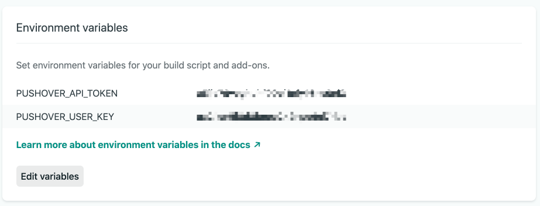
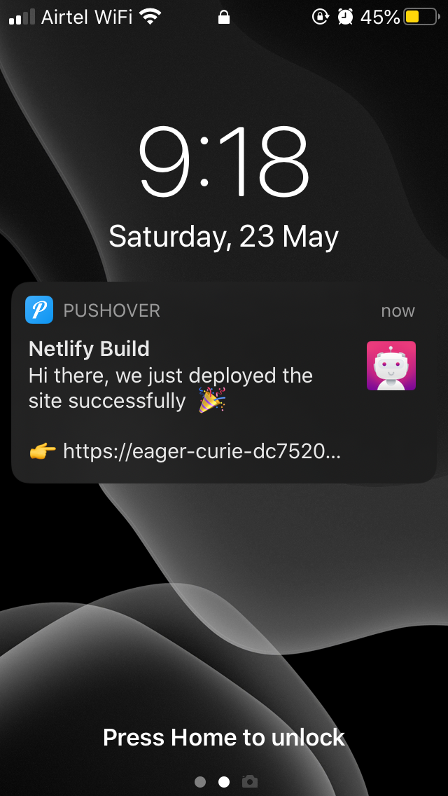
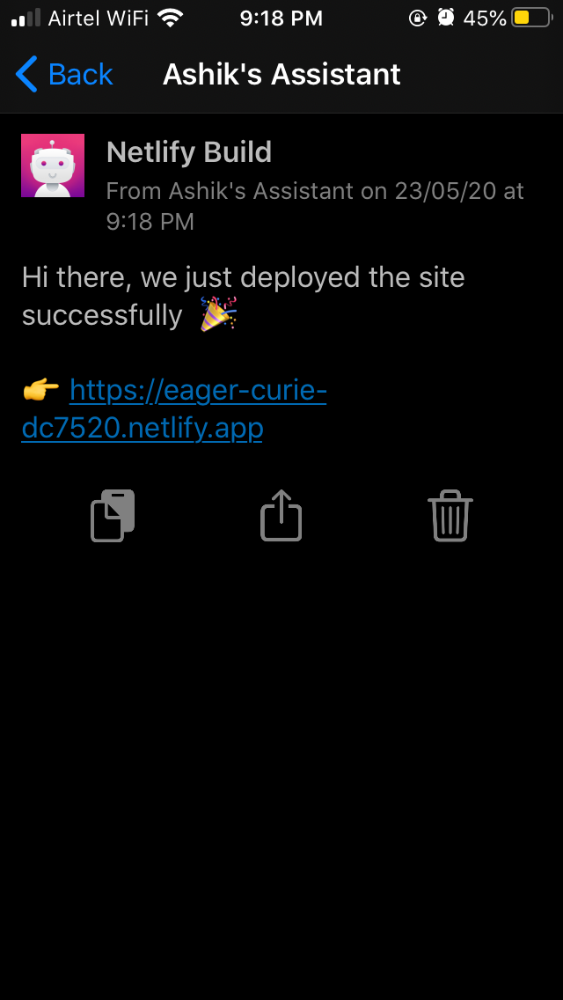

# Netlify Pushover Deploy Plugin
After a successful/error build send  real-time notifications to your Android, iPhone, iPad, and Desktop via [Pushover](http://pushover.net)

## Usage
To include this plugin in your site deployment:

### 1. Add the plugin as a dependency
```sh
# Add the plugin as a dependency to your build
npm i --s netlify-plugin-pushover
```
### 2. Add the plugin as a dependency
Add the following lines to your netlify.toml configuration file:

```
[[plugins]]
package = "netlify-build-plugin-pushover"
```
Note: The [[plugins]] line is required for each plugin, even if you have other plugins in your netlify.toml file already.

### 3. Set the environmental variable in Netlify

Get the api credentials from [Pushover](https://pushover.net/api) and set it as an environmental variable in [Netlify](https://docs.netlify.com/configure-builds/get-started/#build-environment-variables)

- PUSHOVER_USER_KEY
- PUSHOVER_API_TOKEN

If those variables are not present, the build will continue without sending push notification



## Demo

Once configured everything, you'll start getting notifications like this in your device






## Reference
- [Creating and using your first Netlify Build Plugin](https://www.netlify.com/blog/2019/10/16/creating-and-using-your-first-netlify-build-plugin)
